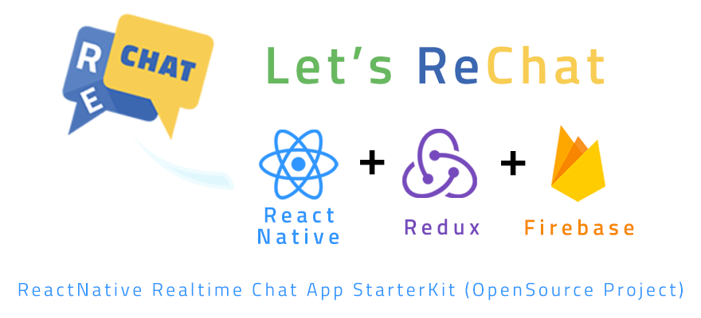
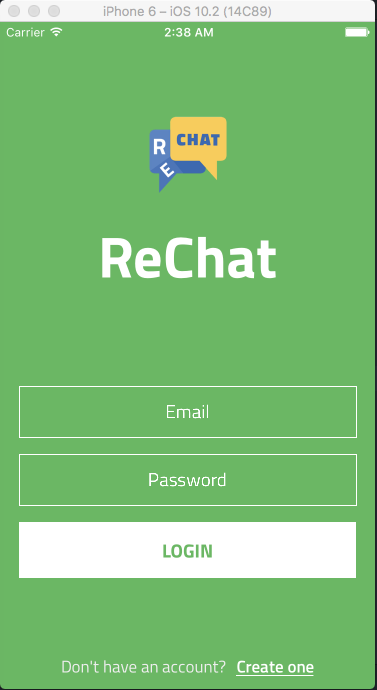
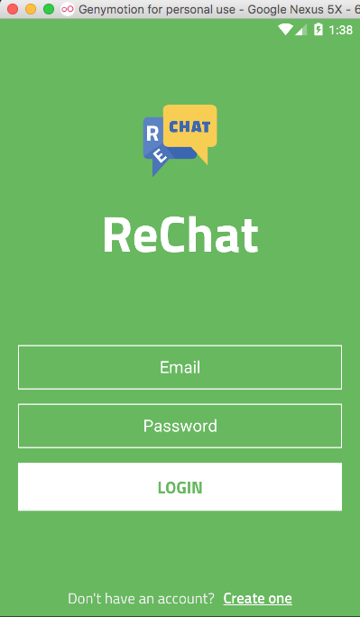

---------------

# [Screenshots](#screenshots)

|  iOS    | Android    |
| :-------: | :----: |
|    |  |

 

---------------

# Why I start this project?
Nowadays, there are many React Native starter projects, seed projects and template projects are published on GitHub.
All those projects has its own advantages and disadvantages.
While I am investigating other senior developers starter kits, I finally summarized all those efforts and made my own source structure depends on many years of my Javascript and React Native experiences.
I think this project should be very helpful for everybody who loves React Native.

For now, it only has base structure and doesn't supports realtime chatting features.

**It will come soon by me** and the developers who wants to contribute to this project.

Therefore, any good ideas and nice suggestions which can promote this project more better are very welcomed and any PRs are fine too.
I am really open minded and I would like to hear about other developers suggestions and recommendations.

**Please don't forget tapping star button above to encourage me. Thanks**

# Content

- [Introduction](#introduction)
- [Installation](#installation)
- [Dependencies](#dependencies)
- [TODO](#todo)
- [FAQ](#faq)

## Introduction
- This app runs on **BOTH** iOS & Android and uses a single codebase which is mostly written in Javascript.
- All dependencies used in this project are latest versions and I will frequently upgrade it's versions.
- Uses ES6
- Uses ESLint Airbnb syntax.
- Uses Redux+Sagas for state management and asynchronous actions.
- Easy routing and navigation with Redux+Navigator.
- I18n MultiLanguage support.
- Easy to change app theme by configuring theme files.

## Installation
* [Install React-Native](https://facebook.github.io/react-native/docs/getting-started.html#content)
* `git clone https://github.com/binzailani3136/ReChat.git`
* `cd ReChat`
* `yarn`
* `react-native link`
* `react-native run-ios` or `react-native run-android`

## Dependencies
*  "firebase": "^3.6.9",
*  "immutable": "^3.8.1",
*  "react": "~15.4.0",
*  "react-native": "0.41.2",
*  "react-native-elements": "^0.9.6",
*  "react-native-i18n": "^1.0.0",
*  "react-native-keyboard-aware-scroll-view": "^0.2.7",
*  "react-native-vector-icons": "^4.0.0",
*  "react-redux": "^5.0.2",
*  "redux": "^3.6.0",
*  "redux-immutable": "^3.0.11",
*  "redux-persist": "^4.3.1",
*  "redux-saga": "^0.14.3",
*  "reduxsauce": "^0.4.1",
*  "seamless-immutable": "^7.0.1"

## TODO
* Login, Register implementation with firebase.
* Contact list.
* 1:1 Realtime chat.
* Discover friends.
* My profile management.
* UI design improvements.

## FAQ
### Can you change the app design and flow depend on the suggestions?
Yes. Nice ideas and suggestions are very welcomed and I have the will to change my current design depend on other developers suggestions. Suggest me nice ideas!
### Do you accept PR's?
Yes. This project is actively under development and PR's are much appreciated.
